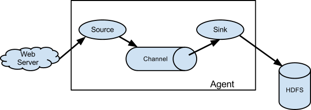

## 一、概述

Flume 是 Apache 提供的一个高可用、高可靠、分布式的系统，用于**有效地收集、聚合和移动大量日志数据到集中式数据存储**。Flume 基于流式架构，灵活简单。它专为**日志数据**收集服务设计，但也适用于各种其他数据流场景。

## 二、 前言

Flume 官网文档地址：https://flume.apache.org/FlumeUserGuide.html

Flume Source 端采用 Kafka 官网文档地址：https://flume.apache.org/FlumeUserGuide.html#kafka-source

Flume Sink 端采用 Kafka ：https://flume.apache.org/FlumeUserGuide.html#flume-sinks

下载地址：https://flume.apache.org/download.html

github 地址：https://github.com/apache/logging-flume


## 三、Flume 架构图



> 1. **Source**：数据的来源。**Source 负责接收或拉取数据进入 Flume 流。**数据可以来自多种来源，如日志文件、网络服务等。
> 2. **Channel：用于在 Source 和 Sink 之间传递事件的缓冲区。**Channel 保证了数据的可靠性，即使在传输过程中遇到系统故障，数据也不会丢失。
> 3. **Sink**：数据的目的地。**Sink 负责将从 Channel 接收到的数据写入到外部存储系统或数据处理平台**，如 HDFS、ElasticSearch 或 Kafka。


### 3.1 架构组件

#### 3.1.1 Agent

​	Agent 是一个 JVM 进程，它以事件的形式将数据从源头送至目的，是 Flume 数据传输的基本单元。

​	Agent 主要有 3 个部分组成，**Source**、**Channel**、**Sink**。

#### 3.1.2 Source

​	Source 是负责接收数据到 Flume Agent 的组件。Source 组件可以处理各种类型、各种格式的日志数据，包括 avro、thrift、exec、jms、spooling directory、taildir、twitter、kafka、netcat、sequence generator、syslog、http、legacy 等。

#### 3.1.3 Channel

​	Channel 是位于 Source 和 Sink 之间的缓冲区。因此，Channel 允许 Source 和 Sink 运行在不同的速率上。**Channel 是线程安全的**，可以同时处理几个 Source 的写入操作和几个 Sink 的读取操作。

​	Channel 支持的类型包括：

- Memory：事件存储到内存中。
- JDBC：事件存储到数据库中。
- Kafka：事件存储到 Kafka 中
- File：事件写入到磁盘中。
- Custom：事件写入到自定义中。


#### 3.1.4 Sink

​	Sink 不断地轮询 Channel 中的事件且批量地移除它们，并将这些事件批量写入到存储（HDFS、Kakfa等）系统、或者发送到另一个 Flume Agent。

​	Sink 是完全事务性的。在从 Channel 批量删除数据之前，每个 Sink 用 Channel 启动一个事务。批量事件一旦成功写出到存储系统或下一个 Flume Agent，Sink 就利用 Channel 提交事务。事务一旦被提交，该 Channel 从自己的内部缓冲区删除事件。

​	Sink 组件目的地包括：

- HDFS
- Hive
- Logger
- Avro
- Thrift
- IRC
- File Roll
- Null
- HBase
- Kafka
- Http
- Custom：自定义

#### 3.1.5 Event

​	传输单元，Flume 数据传输的基本单元，以事件的形式将数据从源头送至目的地。

​	Event 由`Header`和`Body`两部分组成，Header 用来存放该 event 的一些属性，为 K-V 结构，Body 用来存放该条数据，形式为字节数组。

##### 设计原因

> 1. **灵活性**：`header`是一个键值对集合(Map)，**允许在事件中附加元数据**，如时间戳、源标识、类型等。这种设计提供了极大的灵活性，使得在整个数据流传输过程中，可以根据需要动态添加、读取和修改事件的元信息。
> 2. **兼容性**：`Body`是一个字节数组(byte array)，**可以存储任何形式的数据**，无论是文本、二进制文件还是序列化对象。这意味着 Flume 可以处理各种数据类型，不受内容格式的限制，保证了与各种数据源和目的地的兼容性。
> 3. **高效性**：使用字节数组作为`Body`的存储格式，可以高效地在网络中传输数据，同时也便于存储和处理。由于字节数组在 Java 中也是一种基础且高效的数据结构，它适合用来表示未加工的数据流。

##### Body 大小限制

`Event`的`Body`大小本身在 Flume 的设计中没有硬性限制，但实际上，由于内存和网络带宽的限制，以及目的地系统（如 Kafka）可能对消息大小有自己的限制，通常需要根据具体的使用场景来确定一个合理的大小。例如，Kafka 默认的最大消息是 1MB，尽管这个值是可以配置的。

##### 源码角度

从源码角度看，`Event`的定义体现了其简洁且高效的设计理念。下面是`Event`接口的源代码。

```java
package org.apache.flume;

import java.util.Map;

public interface Event {
    Map<String, String> getHeaders();

    void setHeaders(Map<String, String> var1);

    byte[] getBody();

    void setBody(byte[] var1);
}
```

在这个接口中，`getHeaders`和`setHeaders`方法用于操作事件的元数据，而`getBody`和`setBody`方法则用于获取和设置事件的主体数据。这种设计使得 Flume 能够灵活地处理各种数据类型和格式，同时保持高效的数据处理和传输能力。


## 四、安装

1. 将 apache-flume-1.11.0-bin.tar.gz 上传到 linux 的 /usr/local 目录下

2. 解压 apache-flume-1.11.0-bin.tar.gz 到 /usr/local/ 目录下

   > tar -zxf apache-flume-1.11.0-bin.tar.gz -C /usr/local/

3. 修改 apache-flume-1.11.0-bin 文件夹名称为 flume

   > mv apache-flume-1.11.0-bin flume

4. 将 flume/conf 下的 flume-env.sh.template 文件修改为 flume-env.sh，并配置 flume-env.sh 文件

   > mv flume-env.sh.template flume-env.sh
   >
   > vi flume-env.sh
   >
   > export JAVA_HOME=/usr/local/jdk1.8.0_144

## 五、案例

### 5.1 Kafka -> Memory -> Kafka

```shell
vi kafka-memory-kafka.conf
```

```properties
# 定义 agent、source、channel、sink 名称，并绑定关系
a1.sources = r1
a1.sinks = k1
a1.channels = c1

# source 
a1.sources.r1.type = org.apache.flume.source.kafka.KafkaSource
a1.sources.r1.channels = c1
a1.sources.r1.batchSize = 3
a1.sources.r1.batchDurationMillis = 2000
# kafka 服务地址
a1.sources.r1.kafka.bootstrap.servers = 192.162.11.25:9092
# topic 名称
a1.sources.r1.kafka.topics = flume-source-kafka2
# 拦截器
a1.sources.r1.interceptors = i1 i2
a1.sources.r1.interceptors.i1.type = static
a1.sources.r1.interceptors.i1.key = topic
a1.sources.r1.interceptors.i1.preserveExisting = false
# sink 端 topic 名称
a1.sources.r1.interceptors.i1.value = flume-collect-kafka2

# sink
a1.sinks.k1.channel = c1
a1.sinks.k1.type = org.apache.flume.sink.kafka.KafkaSink
a1.sinks.k1.kafka.flumeBatchSize = 3
# kafka 服务地址
a1.sinks.k1.kafka.bootstrap.servers = 192.162.11.191:9092
# topic 名称
a1.sinks.k1.kafka.topic = flume-collect-kafka2
a1.sinks.k1.kafka.producer.acks = 1
a1.sinks.k1.kafka.producer.linger.ms = 1
a1.sinks.k1.kafka.producer.compression.type = snappy

# channel
a1.channels.c1.type = memory
a1.channels.c1.capacity = 1000
a1.channels.c1.transactionCapacity = 1000
a1.channels.c1.keep-alive = 10
```

启动命令

```shell
nohup /usr/local/flume/bin/flume-ng agent \
-n a1 \
-c /usr/local/flume/conf/ \
-f /usr/local/flume/conf/kafka-memory-kafka.conf \
-Dflume.root.logger=INFO,console \
> /usr/local/flume/conf/kafka-memory-kafka.log 2>&1 &
```


### 5.2 Kafka -> Kafka -> Kafka

```shell
vi kafka-kafka-kafka.conf
```

```properties
# 定义 agent、source、channel、sink 名称，并绑定关系
a1.sources = r1
a1.sinks = k1
a1.channels = c1

# source
a1.sources.r1.type = org.apache.flume.source.kafka.KafkaSource
a1.sources.r1.channels = c1
a1.sources.r1.batchSize = 3
a1.sources.r1.batchDurationMillis = 2000
# Kafka 服务地址
a1.sources.r1.kafka.bootstrap.servers = 192.162.11.25:9092
# topic 名称
a1.sources.r1.kafka.topics = flume-source-kafka
# i1 i2 为拦截器，拦截器执行顺序根据配置顺序执行
a1.sources.r1.interceptors = i1 i2
a1.sources.r1.interceptors.i1.type = static
a1.sources.r1.interceptors.i1.key = topic
a1.sources.r1.interceptors.i1.preserveExisting = false
# sink 端 topic 名称
a1.sources.r1.interceptors.i1.value = flume-collect-kafka
# 自定义拦截器插件
a1.sources.r1.interceptors.i2.type = com.bda.dcp.flume.interceptor.JsonInterceptor$Builder
a1.sources.r1.interceptors.i2.keyword=hello, fly

# sink
a1.sinks.k1.channel = c1
a1.sinks.k1.type = org.apache.flume.sink.kafka.KafkaSink
a1.sinks.k1.kafka.flumeBatchSize = 3
# kafka 服务地址
a1.sinks.k1.kafka.bootstrap.servers = 192.162.11.191:9092
# topic 名称
a1.sinks.k1.kafka.topic = flume-collect-kafka
a1.sinks.k1.kafka.producer.acks = 1
a1.sinks.k1.kafka.producer.linger.ms = 1
a1.sinks.k1.kafka.producer.compression.type = snappy

# channel
a1.channels.c1.type = org.apache.flume.channel.kafka.KafkaChannel
# kafka 服务地址
a1.channels.c1.kafka.bootstrap.servers = 192.162.11.25:9092
# topic 名称
a1.channels.c1.kafka.topic = flume-channel
a1.channels.c1.kafka.consumer.auto.offset.reset = latest
```

启动命令

```shell
nohup /usr/local/flume/bin/flume-ng agent \
-n a1 \
-c /usr/local/flume/conf/ \
-f /usr/local/flume/conf/kafka-kafka-kafka.conf \
-Dflume.root.logger=INFO,console \
> /usr/local/flume/conf/kafka-kafka-kafka.log 2>&1 &
```


