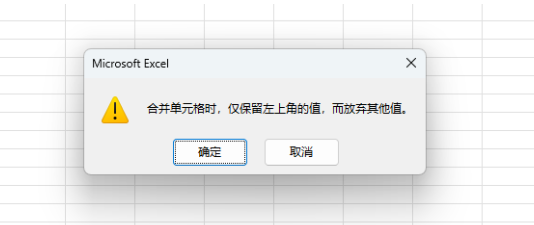
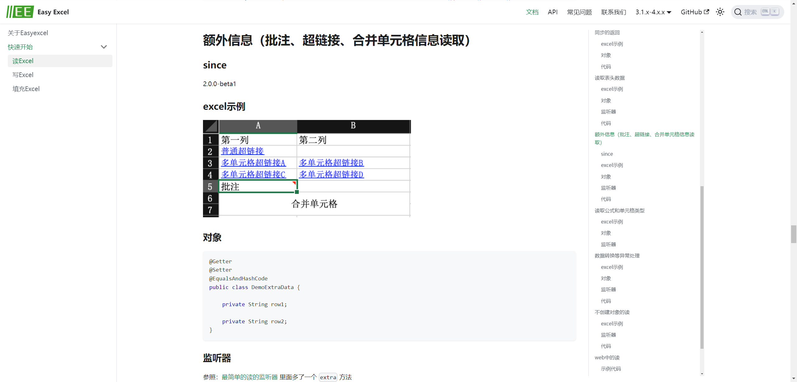

## EasyExcel

EasyExcel 文档地址：https://easyexcel.opensource.alibaba.com/docs/current/quickstart/read


## 一、前言

当 excel 表格的数据表头和内容都比较工整，每个单元格对应一个数据时，通过 EasyExcel 可以很容易就将数据读取出来。但是当表格数据存在`合并单元格`时，还是按照 EasyExcel 原来的方式读取数据，读取出来的数据只有合并单元格的`首行`才有数据，其他行的数据均为`null`。


## 二、问题分析

首先需要知道 `excel`表格合并单元格的原理：`在合并单元格时，仅保留左上角的值，而放弃其他值`。



也就是说合并的单元格取的值都是`左上角的值`。


## 三、实现

EasyExcel 处理合并单元格文档地址：

[https://easyexcel.opensource.alibaba.com/docs/current/quickstart/read#%E9%A2%9D%E5%A4%96%E4%BF%A1%E6%81%AF%E6%89%B9%E6%B3%A8%E8%B6%85%E9%93%BE%E6%8E%A5%E5%90%88%E5%B9%B6%E5%8D%95%E5%85%83%E6%A0%BC%E4%BF%A1%E6%81%AF%E8%AF%BB%E5%8F%96](https://easyexcel.opensource.alibaba.com/docs/current/quickstart/read#额外信息批注超链接合并单元格信息读取)



### 监听器

```java
import com.alibaba.excel.context.AnalysisContext;
import com.alibaba.excel.metadata.CellExtra;
import com.alibaba.excel.read.listener.ReadListener;
import lombok.Getter;
import lombok.extern.slf4j.Slf4j;

import java.util.ArrayList;
import java.util.List;

/**
 * Excel 监听器
 * Created by fengxuguang on 2024/5/23 9:41
 */
@Getter
@Slf4j
public class ExcelListener<T> implements ReadListener<T> {

    private final List<T> list = new ArrayList<>();

    private Integer headNumber = 0;

    private final List<CellExtra> extraMergeList = new ArrayList<>();

    public ExcelListener(Integer headNumber) {
        this.headNumber = headNumber;
    }

    @Override
    public void invoke(T data, AnalysisContext analysisContext) {
        if (analysisContext.readRowHolder().getRowIndex() >= headNumber) {
            list.add(data);
        }
    }

    @Override
    public void extra(CellExtra extra, AnalysisContext context) {
        switch (extra.getType()) {
            case COMMENT:
                log.info("解析到一条注释:{}", extra.toString());
                break;
            case HYPERLINK:
                log.info("解析到一条链接:{}", extra.toString());
                break;
            case MERGE:
//                log.info(
//                        "额外信息是超链接,而且覆盖了一个区间,在firstRowIndex:{},firstColumnIndex;{},lastRowIndex:{},lastColumnIndex:{}",
//                        extra.getFirstRowIndex(), extra.getFirstColumnIndex(), extra.getLastRowIndex(),
//                        extra.getLastColumnIndex());
                if (extra.getRowIndex() >= headNumber) {
                    extraMergeList.add(extra);
                }
                break;
            default:
                break;
        }
        ReadListener.super.extra(extra, context);
    }

    @Override
    public void doAfterAllAnalysed(AnalysisContext analysisContext) {

    }
}
```

在读取文件的时候添加 `.extraRead(CellExtraTypeEnum.MERGE)`就能获取所有的合并单元格，代码如下：

```java
ExcelListener<T> readListener = new ExcelListener<T>(headRowNumber);
EasyExcel.read(inputStream, clazz, readListener)
        // 需要读取合并单元格信息 默认不读取
        .extraRead(CellExtraTypeEnum.MERGE)
        .sheet(sheetIndex)
        .doRead();
```


在`EasyExcel`中可以通过 `@ExcelProperty`中的`index`属性来标明该字段的索引，例如：

```java
@ExcelProperty(value = "名称", index = 2)
private String name;
```
