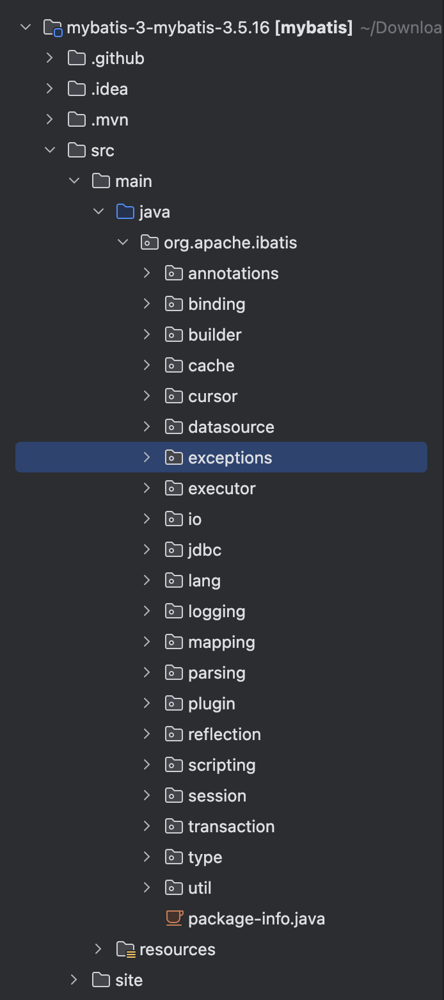
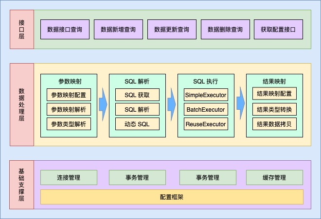
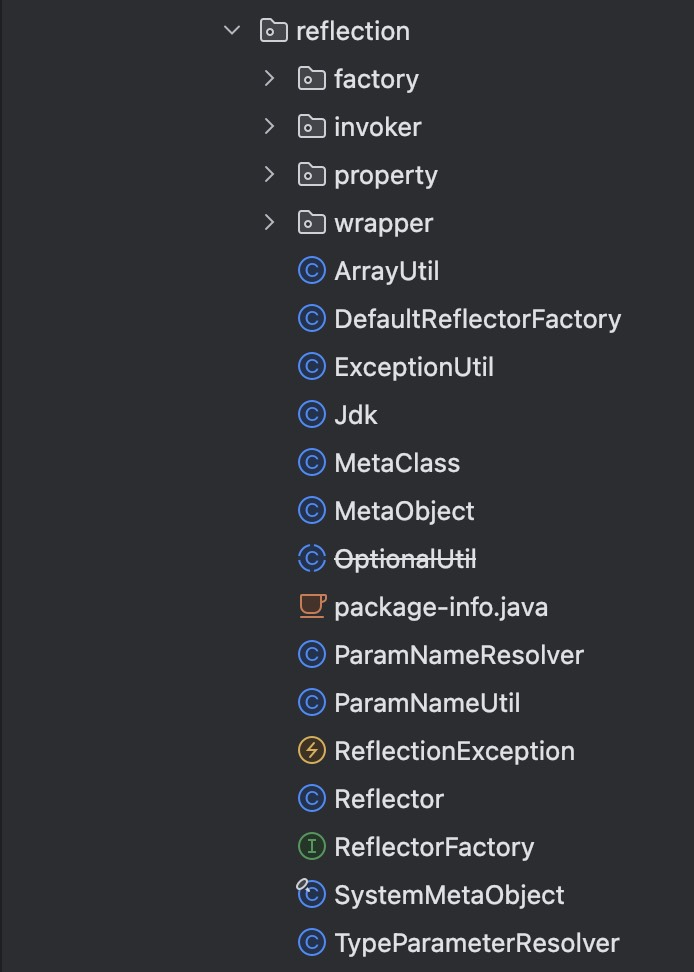
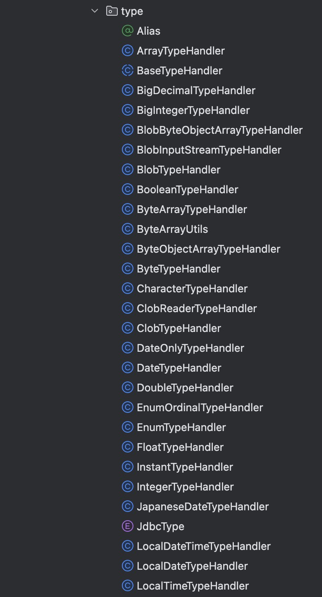

## 1. 前言

> 为了让我们更清晰了解 Mybatis 的整体结构，本文主要分享一下关于 Mybatis 的项目结构。

## 2. 整体结构

>Mybatis 的整体结构分为三层：
>
>1. 基础支持层：负责 Mybatis 与数据库连接方式管理、管理方式、缓存管理、配置文件加载。
>2. 核心处理层：负责参数解析与参数绑定、sql 解析、结果映射的解析与处理
>3. 接口层：核心是 SqlSession 接口，该接口中定义了 Mybatis 暴露给应用程序调用的 API

### 3.1 基础支持层

#### 3.1.1 反射模块

> 该模块对 Java 原生的反射进行了良好的封装，提供了更加**简洁易用的 API**，方便上层调用，并且对反射操作进行了一系列优化。

项目包路径：`org/apache/ibatis/reflection`

#### 3.1.2 类型模块

> 类型模块提供了别名机制，这也是该模块的主要功能
>
> 类型模块实现了 JDBC 类型与 JAVA 类型的转换：
>
> - 在为 SQL 语句绑定实参时，会将数据由 Java 类型转换成 JDBC 类型。
> - 而在映射结果集时，会将数据由 JDBC 类型转换成 Java 类型。

项目包路径：`org/apache/ibatis/type`

#### 3.1.3 日志模块

> Mybatis 可以详细的输入日志信息，同时还可以集成多种日志框架，例如 Log4j、Slf4j 等

项目包路径：`org/apache/ibatis/type`

