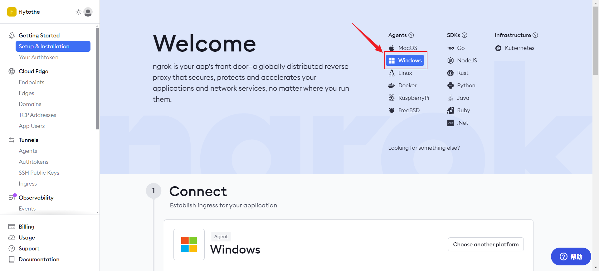
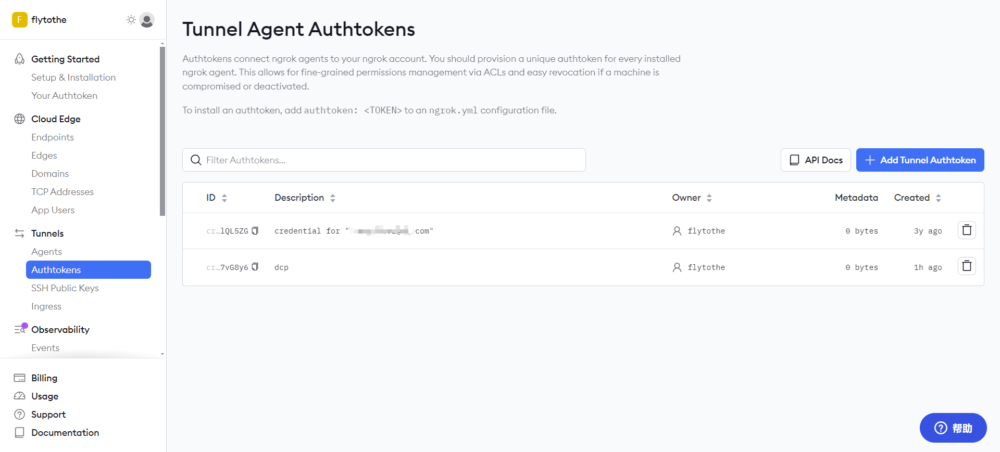
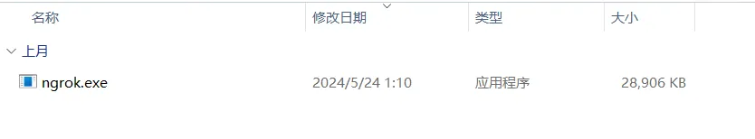
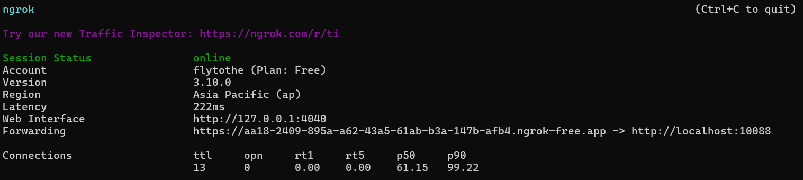

## 一、ngrok 官网地址

https://ngrok.com/，使用 github 账号登录。

## 二、下载

登录成功后下载对应软件



## 三、获取鉴权 token



## 四、使用



安装包下载后解压，点击“ngrok.exe”文件执行。

执行后会弹出 DOS 命令框


1. 输入如下命令进行 token 授权

```shell
ngrok authtoken <token>
```

2. 暴露服务端口

```shell
ngrok http 10088
```


