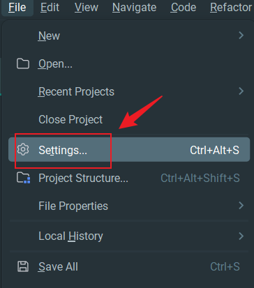

## 一、IDea 中安装 Vim 插件

在 IDEA 中安装如下三个插件：

- IdeaVim
- IdeaVimExtension
- IdeaVim-EasyMotion

> 当你的光标变成了小方块后，说明你的 vim 插件安装好了~

## 二、Vim 的使用

### 1. 进入插入模式

按下【i, I, o, O, a, A, r, R】等任何一个字母后进入编辑模式。这时候 IDEA 右下方合会出现 【INSERT】的字样，此时才可以进行编辑。按【ESC】即可退出编辑模式。

- a 在光标后，进入插入模式；
- A 在本行结尾，进入插入模式；
- i 在光标前，进入插入模式；
- I 在本行开头，进入插入模式；
- o 在本行之后新增一行，并进入插入模式；
- O 在本行之前新增一行，并进入插入模式；
- s 删除当前字符，并进入插入模式；
- S 删除当前行中的所有文本，并进入插入模式；

### 2. 移动光标

【h、j、k、l】，分别控制光标左、下、上、右移一个。

### 3. 复制 & 粘贴

- yy：复制光标所在行
- nyy：复制光标所在向下 n 行
- y1G：复制光标所在行到第一行的所有数据
- yG：复制光标所在行到最后一行的所有数据
- y0：复制光标所在的那个字符到该行行首的所有数据
- y$：复制光标所在的那个字符到该行行尾的所有数据
- p：将已复制的数据在光标下一行粘贴上
- P：将已复制的数据在光标上一行粘贴上
